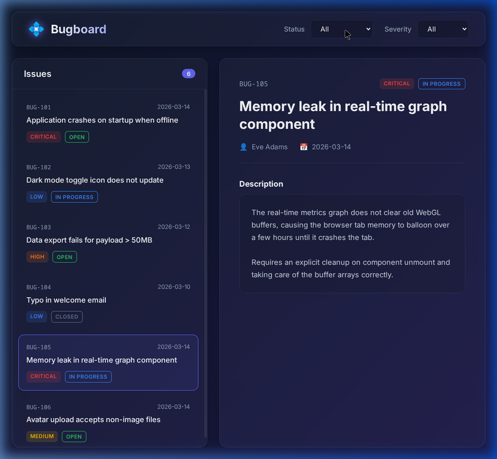

# Bugboard - Issue Triage

A tiny, static issue-triage dashboard created with plain HTML, CSS, and Vanilla JavaScript.



## Features

- **Framework-Free**: Built entirely with vanilla web technologies, requiring no build tools or complicated configurations.
- **Glassmorphism Design**: Minimalist and modern aesthetic utilizing dark mode, smooth background gradients, and frosted-glass panels (`backdrop-filter`).
- **Dynamic Filtering**: Quickly filter mock issues by `Status` (Open, In Progress, Closed) or `Severity` (Low, Medium, High, Critical) using intuitive top-level dropdowns.
- **Auto-Selection Logic**: Selecting a filter dynamically auto-selects the top issue from the new working set, preventing disconnected or dead UI states.
- **Smart Empty States**: If filter combinations result in zero visible issues, the dashboard displays appropriate visual feedback to alert the user.

## Getting Started

Because it contains zero dependencies, you can run this instantly:

### Method 1: Local Development Server (Recommended)

You can spawn a quick HTTP server using Python:

```bash
cd bugboard
python3 -m http.server 8080
```

Then navigate to `http://localhost:8080` in your web browser.

### Method 2: Direct File Execution

You can easily interact with Bugboard by just double-clicking `index.html` from your file explorer to open it up in any modern browser.

## Tech Stack

- **HTML5**: Semantic tags establishing the core app shell structure.
- **CSS3**: Variables (Custom Properties) managing design tokens, grid/flexbox based layouts, hover interactive states, and CSS animation (`@keyframes`).
- **JavaScript (ES6+)**: Data filtering, DOM element creation (`document.createElement`), and event-based dynamic DOM mutations.

## Mock Data Simulation

The project uses an in-memory javascript array of mock objects defined within `script.js` to simulate a JSON payload or REST API response. It allows robust testing of list updates and string injections without connecting to a real database.

## License

This project is dedicated to the public domain under The Unlicense. Feel free to copy, modify, and use it however you wish.
